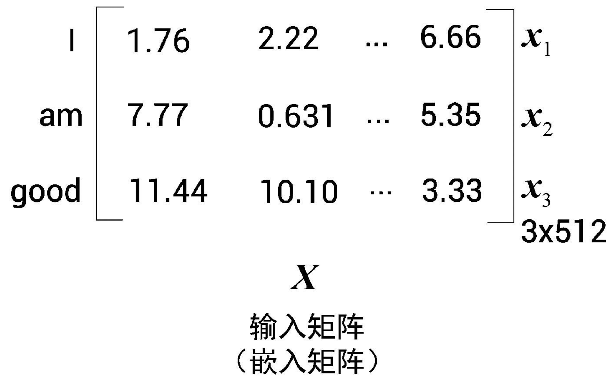

-
- BERT = Bidirectional Encoder Representations from Transformers
-
- # 开始使用 BERT
- ## 1 Transformer概览
- ### 1.1 Transformer 简介
- RNN和LSTM都用于时序任务，如文本预测、机器翻译、文章生成等，问题是如何记录长期依赖（？）。
- Transformer为解决这个问题而生。
- Transformer依赖于注意力极致，摒弃了循环。
-
- Transformer基本工作原理：
- (文本) --> 编码器 --> (特征) --> 解码器 --> (文本)
-
-
- ### 1.2 理解编码器
- Transformer中编码器不止一个，而是由一组 N 个编码器串联而成。一个编码器的输出作为下一个编码器的输入，编码器的主要功能就是提取原句中的特征。
- 编码器可以分解为两个部分：
- 多头注意力层 --> 前馈网络层
-
- #### 1.2.1 自注意力机制
- 比如例句： A dog ate the food because it was hungry. 我们理解it代指dog，而非其他，那模型是如何判断出来的呢？这就要靠自注意力机制。
- 模型会计算每个单词的特征值：当计算每个词的特征值时，模型需要遍历每个词与句子中其他词的关系。在这个例子中，it 与 dog的关系最紧密。
-
- 嵌入向量：
- 假设输入原句为 I am good, 将每个词转化为嵌入向量，分别用 $$x_1$$, $$x_2$$, $$x_3$$ 代表三个词的嵌入向量：
- $$x_1 = [1.76, 2.22, ..., 6.66]$$
- $$x_2 = [7.77, 0.631, ..., 5.35] $$
- $$x_3 = [11.44, 10.10, ..., 3.33] $$
-
- 这样，该输入句就可以用一个矩阵（嵌入矩阵）来表示：
- 
-
-
-