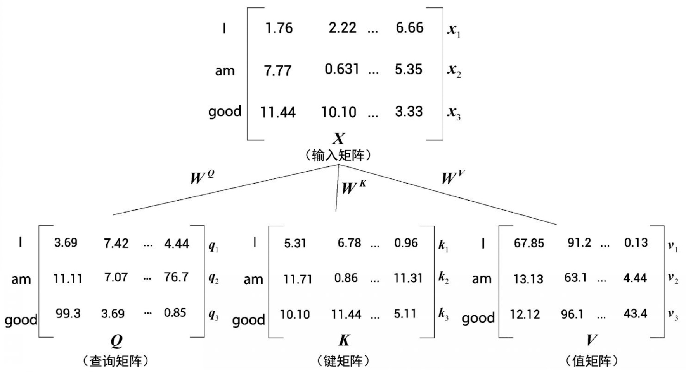
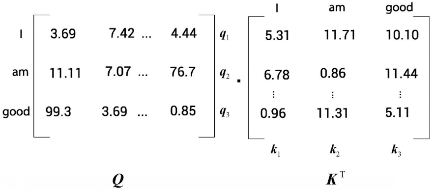
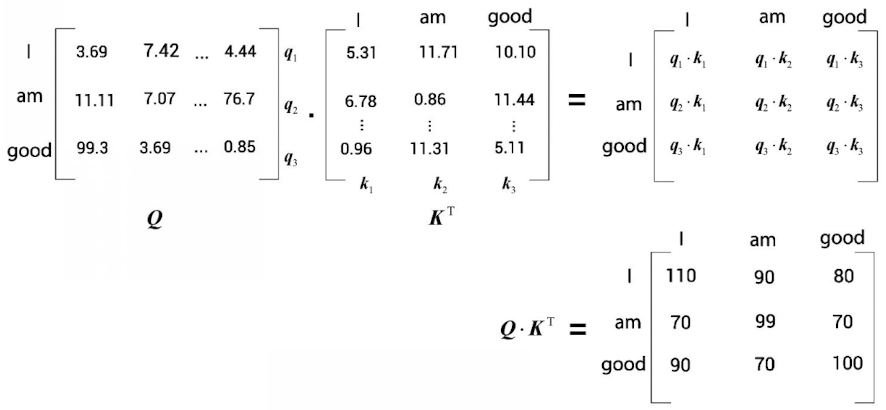
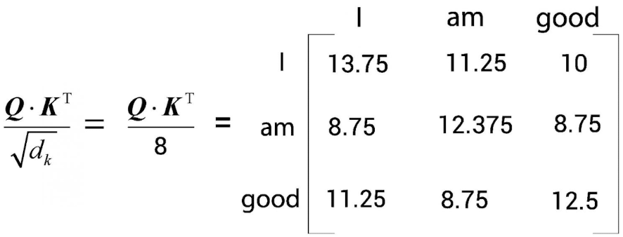
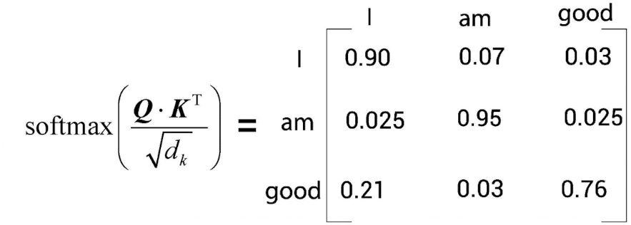
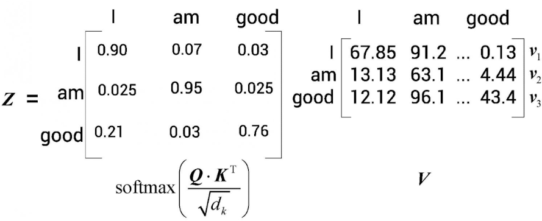
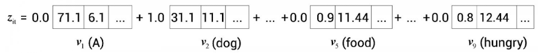
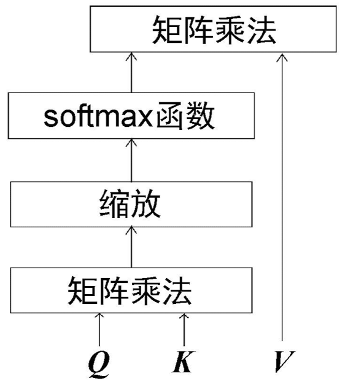
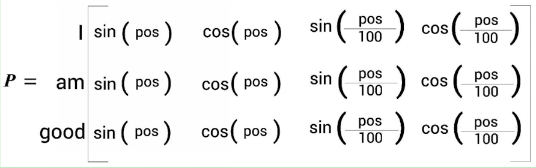
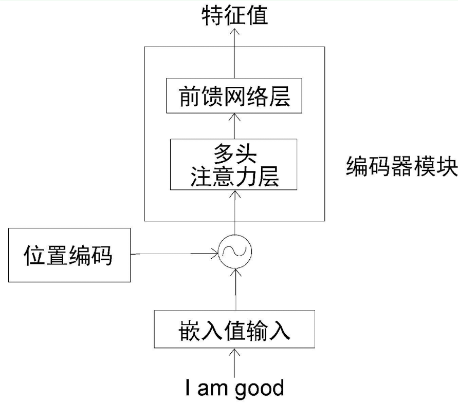

-
- BERT = Bidirectional Encoder Representations from Transformers
-
- # 开始使用 BERT
- ## 1 Transformer概览
- ### 1.1 Transformer 简介
- RNN和LSTM都用于时序任务，如文本预测、机器翻译、文章生成等，问题是如何记录长期依赖（？）。
- Transformer为解决这个问题而生。
- Transformer依赖于注意力极致，摒弃了循环。
-
- Transformer基本工作原理：
- (文本) --> 编码器 --> (特征) --> 解码器 --> (文本)
-
-
- ### 1.2 理解编码器
- Transformer中编码器不止一个，而是由一组 N 个编码器串联而成。一个编码器的输出作为下一个编码器的输入，编码器的主要功能就是提取原句中的特征。
- 编码器可以分解为两个部分：
- 多头注意力层 --> 前馈网络层
-
- #### 1.2.1 自注意力机制
- 比如例句： A dog ate the food because it was hungry. 我们理解it代指dog，而非其他，那模型是如何判断出来的呢？这就要靠自注意力机制。
- 模型会计算每个单词的特征值：当计算每个词的特征值时，模型需要遍历每个词与句子中其他词的关系。在这个例子中，it 与 dog的关系最紧密。
-
- 嵌入向量：
- 假设输入原句为 I am good, 将每个词转化为嵌入向量，分别用 $$x_1$$, $$x_2$$, $$x_3$$ 代表三个词的嵌入向量：
- $$x_1 = [1.76, 2.22, ..., 6.66]$$
- $$x_2 = [7.77, 0.631, ..., 5.35] $$
- $$x_3 = [11.44, 10.10, ..., 3.33] $$
-
- 这样，该输入句就可以用一个矩阵（嵌入矩阵）来表示：
- 
-
-
- 输入矩阵的维度为 [句子的长度 * 词嵌入向量维度]，如果词嵌入向量维度为512，则该输入矩阵的维度是[3*512]
- 而词嵌入向量维度是在模型设计是指定的，一般会根据计算资源、数据集大小、任务复杂性等因素来考虑。
-
- 根据输入矩阵X，再创建三个矩阵：查询矩阵Q、键矩阵K、值矩阵V。
- 为了创建这三个矩阵，我们需要先创建三个权重矩阵，分别为 $$W^Q$$、$$W^K$$、$$W^V$$
- 将输入矩阵X，分别乘以这三个权重矩阵，可得到查询矩阵、键矩阵、值矩阵，如下图示：
- 
-
- 理解自注意力机制，自注意力机制包含四个步骤：
- 1、计算查询矩阵Q和键矩阵K的点积
- 因为计算矩阵点积，所以要将K转置，变成 $$K^T$$
- 
-
-
-
- 
- 通过查询向量和键向量的点积，可以了解单词之间的相似度。
-
- 2、将$$Q \cdot K^T$$矩阵除以键向量维度的平方根，这样做的目的是获得稳定的梯度。
- 
-
- 3、使用softmax函数对其结果进行归一化处理：
- softmax函数使得数组分布在0~1的范围内，且每一行的所有数之和等于1.
- 
- 上面这个矩阵称为分数矩阵，通过这些分数，可以了解到句子内每个词与其他词的相关程度。
-
- 4、最后一步是计算注意力矩阵 $$Z$$: 将分数矩阵 $$softmax(\frac {Q \cdot K^T} {\sqrt{d_K}} )$$ 乘以 值矩阵 V 得到。
- 
- 注意力矩阵Z就是值向量与分数加权之后求和所得到的结果，这样便于模型理解词的之间的相关度，比如例句中的 A dog ate the food because it was hungry, 计算it的自注意力值：
- 
-
- 自注意力矩阵公式：
- $$Z = softmax(\frac {Q \cdot K^T} {\sqrt{d_K}} ) \times V $$
-
- 总结下自注意力机制的计算步骤：
- 1、计算查询矩阵与键矩阵的点积，求得相似值，称为分数
- 2、将分数除以键向量维度的平方根，这一步是缩放处理
- 3、用softmax函数对分数缩放结果进行归一化处理，得到分数矩阵
- 4、通过将分数矩阵与值矩阵相乘，计算出注意力矩阵 Z
-
- 
-
-
- #### 1.2.2 多头注意力层
- 为了确保词的关系尽可能准确，因此不能依赖单一的注意力矩阵（为什么？），应该计算多个注意力矩阵，将结果串联起来。
- 假设需要计算两个注意力矩阵$$Z_1$$ 和 $$Z_2$$，那么我们需要分别计算：
	- 对于 $$Z_1$$   先引入三个权重矩阵 $$W^Q_1$$   $$W^K_1$$  $$W^V_1$$，然后用矩阵X分别乘以权重矩阵，得到查询矩阵、键矩阵和值矩阵，再用自注意力矩阵计算公式可得到。
	- 对于$$Z_2$$   同理先引入三个权重矩阵 $$W^Q_2$$   $$W^K_2$$  $$W^V_2$$，然后……
- 这些自注意力矩阵串联起来，然后将结果乘以一个新的权重矩阵，得到最终的注意力矩阵。
-
- #### 1.2.3 通过位置编码来学习位置
- 在RNN中，句子是逐字送入学习网络的。而在Transformer模型中，是将句子所有词并行地输入到神经网络中。这种情况下，如何表达词序是个问题。为了表明词序信息，便于神经网络理解句子的含义，因而引入了一种叫“位置编码”的技术。
- "Attention is all you need" 使用正弦函数来计算位置编码：
- 
-
- 编码器结构：
- 
-
- #### 1.2.4 前馈网络层
-
-
-