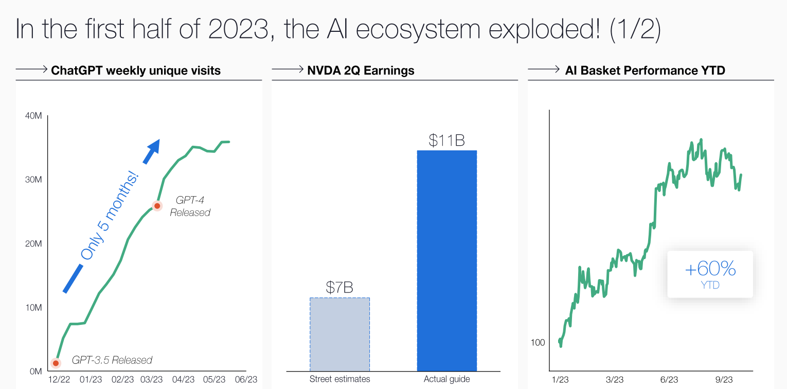
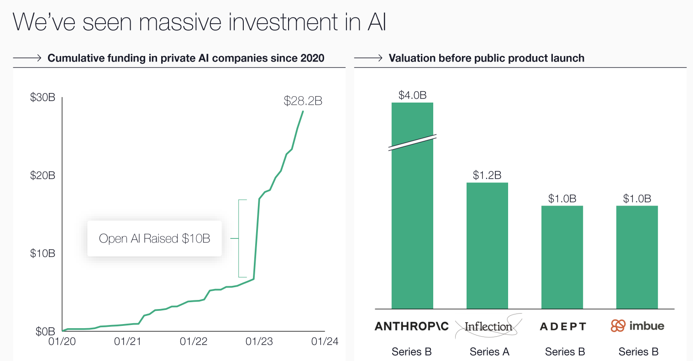

- Coatue AI 报告分为五个部分：
	- 当前AI的状态
	- AI不是泡沫
	- 开源是AI的命脉
	- AI正在改变技术生态
	- 总结观点：最好的AI还没有出现
	- 
- # Where we are in AI today
	- 1990：互联网起步；
	- 2005：移动互联网起步
	- 2020：AI时代起步
	- 
	- 2023年上半年，AI生态爆炸
	- 
	- 
	- AI应用比以往的新技术都要快：
	- 
	- 
	- 
	- 
	- 
	-
- # AI
	-
	-