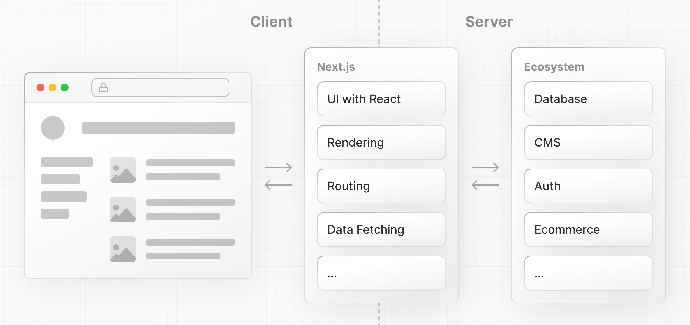
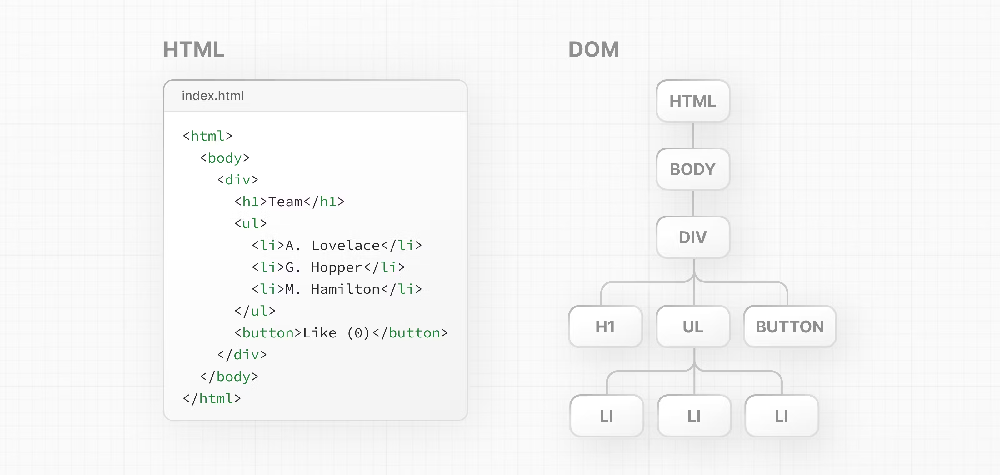

- Ref: https://nextjs.org/learn/react-foundations/what-is-react-and-nextjs
-
- Next.js is a flexible **React framework** that gives you building blocks to create fast, full-stack **web applications**.
-
- 构建现代化Web应用所需要关注的点：
- **User Interface** - how users will consume and interact with your application.
- **Routing** - how users navigate between different parts of your application.
- **Data Fetching** - where your data lives and how to get it.
- **Rendering** - when and where you render static or dynamic content.
- **Integrations** - what third-party services you use (for CMS, auth, payments, etc.) and how you connect to them.
- **Infrastructure** - where you deploy, store, and run your application code (serverless, CDN, edge, etc.).
- **Performance** - how to optimize your application for end-users.
- **Scalability** - how your application adapts as your team, data, and traffic grow.
- **Developer Experience** - your team's experience building and maintaining your application.
-
- ## 什么是 React
- [React](https://react.dev/) is a JavaScript **library** for building **interactive user interfaces**.
-
- React核心思想：封装组件。各个组件维护自己的状态和UI，当状态变更，自动重新渲染整个组件。
- 几个核心概念：
	- 组件
	- JSX
	- Virtual DOM
	- Data Flow
-
- ## 什么是 Next.js
- Next.js is a React **framework** that gives you building blocks to create web applications.
-
- 
-
- ## 渲染UI (Rendering User Interfaces)
- 浏览器通过解析HTML来生成DOM (Document Object Model)
- 
-
- DOM（文档对象模型）是W3C的标准，定义了访问HTML和XML文档的标准。它是网络文档的编程接口，与平台、语言、浏览器等无关，允许程序和脚本动态的访问和更新文档的内容、结构和样式。DOM将文档表示为节点和对象，这样，编程语言就可以与页面交互。
-