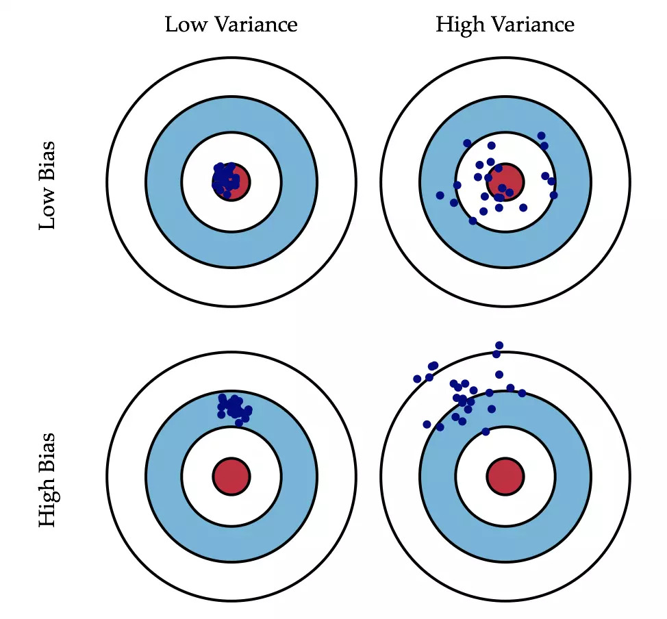

- 参考链接： https://waytoagi.feishu.cn/wiki/PFXnwBTsEiGwGGk2QQFcdTWrnlb?table=tbltvr7KExCt7Jpw&view=vewjxk9tDu
-
- 流派
	- 符号主义(Symbolism): 基于规则和逻辑的AI。符号主义认为所有的知识和推理都可以用符号和规则来表示，即通过大量“if-then”的规则定义，来产生决策和推理。典型的代表是专家系统。
	- 联结主义(Connectionism): 即神经网络或基于学习的AI。联结主义认为知识在大量的联结中存储，模拟了大脑的神经网络，依赖于从数据中学习。典型代表是深度学习。
	- 行为主义(Actionism): 行为主义注重应用和身体模拟，认为人工智能的基础是控制论和感知行为。主要应用在机器人、自动控制、自动驾驶等领域。
- 概念
	- AI 人工智能
		- 人工智能的研究从以“推理”为重点，到以“知识”为重点，再到以“学习”为重点。
	- 通用人工智能 AGI: 强人工智能
	- 狭义人工智能 ANI: 弱人工智能
	- AIGC 生成式AI：
	- Agent 智能体：
	- Machine Learning 机器学习：
		- Deep learning 深度学习：机器学习的一个分支，以人工神经网络为架构，对资料进行表征学习的算法。
		- Transfer learning 迁移学习：把已训练好的模型参数迁移到新的模型来帮助新模型训练。
	- Neural Network 神经网络：一种受人脑启发的人工智能模型，由连接单元或节点（神经元）组成，这些单元或节点按层组织。神经元接受输入，对它们进行一些技术，产生输出。
	- Emergence 涌现：一种现象，许多小实体相互作用后产生了大实体，而这个大实体会展现出其他小实体所不具有的特性。比如大模型涌现的能力是小模型所不具备的。
	- Inference 推理：使用经过训练的机器学习模型进行预测的过程。
	- Latent Space 潜在空间：指模型（如神经网络）创建的数据的压缩表现形式。
	- Loss Function 损失函数：又叫 Cost Function 成本函数，在模型训练期间试图最小化的函数，它量化了模型的预测与真实值的距离。
	- Multimodal 多模态：指可以理解和生成多种类型的数据（如文本、图像等）信息的模型。
- 分支
	- NLP 自然语言处理：人工智能的分支学科，探讨如何处理和运用自然语言。
	- CV(Computer vision) 计算机视觉：一门研究如何使机器“看”的科学。
- 神经网络
	- CNN(Convolutional Neural Network) 卷积神经网络：一种深度学习模型，通过应用一系列过滤器来处理具有网状拓扑（例如图像）的数据。此类模型同样用于图像识别任务。
	- RNN
	- GAN(General Adversarial Network) 通用对抗网络：一种机器学习模型，用于生成类似于某些现有数据的新数据。它使用两个神经网络相互对抗：一个“生成器”(Generator)，创建新数据；另一个“鉴别器”(Discriminator)，判别生成的数据是真实的还是模拟的。
	- LSTM(Long Short-Term Memory) 长短期记忆：（论文发表于1997年）一种时间循环神经网络（RNN）……
	-
- 模型
	- Foundation model 基础模型
	- CLIP (Contrastive Language-Image Pretraining) 对比语言-图像预训练： 由OpenAI开发的AI模型，用于连接图像和文本，使其能够理解和生成图像描述。
	- Diffusion models 扩散模型：计算机视觉中，通过学习逆扩散过程训练神经网络，使其能够对叠加了高斯噪声（高斯分布即正态分布）的图像进行去噪。是 Dall-E、Stable Diffusion、Midjourney的基础模型。
	-
- 技术
	- Attention 注意力机制：在神经网络的上下文中，注意力机制有助于模型在输出时专注与输入的相关部分
	- Forward propagation 前向传播：在神经网络中，前向传播是输入数据被馈送到网络并通过每一层（从输入层到隐藏层到输出层）以产生输出的过程。网络对输入应用权重和偏差，并使用激活函数最终输出。
	- Backpropagation 反向传播：“误差反向传播”算法的简称，这是一种与最优化方法（如梯度下降算法）结合使用、用来训练神经网络的方法。在神经网络训练中，通过前向传播计算得到的输出值和目标值可能有较大偏差，这时候可以利用反向传播算法先计算总误差，然后按照反向传播遍历图的方式计算损失函数并更新每个节点的权重。
	- AI Alignment 对齐：人工智能对齐是指引导人工智能系统的行为，使其符合设计者的利益和预期目标。
	- Bias 偏差：描述的是根据样本拟合出的模型的输出预测与真实样本结果的差距，即在样本上拟合的好不好。
	- Variance 方差：描述的是模型每一次输出结果与模型输出期望之间的误差的平方的期望，即模型的稳定性。
		- 一图解释偏差与方差： 
	- Cross-model generalization 跨模态泛化：一种机器学习能力，指的的模型能够从一种模态（或类型）的数据中学习，并将这些学习应用在另外一种模态的数据上。类比，真实的人就是在多种感知领域（听觉、视觉、触觉等）之间进行信息传递和学习的。
	- Data augmentation 数据增强：通过添加现有数据的略微修改的副本来增加训练模型的数据量和多样性。
	- Double descent 二次下降：机器学习中的一个现象，其中模型的性能会随着复杂性的增加而提高（误差下降），然后变差，然后再次提高。下降指的是误差下降，即性能提高。
	- Few-shot 小样本学习：也叫少样本学习(low-shot learning)，目标是从少量样本中学习到解决问题的方法。
	- Zero-shot 零样本学习：零样本学习是在没有训练数据的情况下，利用类别属性等信息训练模型，从而识别新类别。
	- Fine-Tuning 微调：迁移模型常用技术，目标模型复制了源模型上除掉了输出层外的所有模型设计及其参数，并基于目标数据集微调这些参数。
	- Hyperparameter tuning 差参数调优：
	- Instruction tuning 指令调优：模型根据数据集中给出的指令进行调优。
	- Fitting 拟合：在机器学习和统计学中，拟合是指使用模型来尽可能准确地描述或预测数据的过程。
	- Gradient Descent 梯度下降：在机器学习中，梯度下降是一种优化方法，它根据模型损失函数的最大改进方向逐渐调整模型的参数。例如，在线性回归中，梯度下降通过反复细化线的斜率和截距来最小化预测误差，从而帮助找到最佳拟合度。
	- Knowledge distillation 数据蒸馏：旨在将一个原始的大数据集浓缩并生成一个小型数据集，使得在这一小数据集上训练处的模型，在和原始数据集上训练得到的效果相似。
	- Mixture of experts 专家组合：一种机器学习技术，其中训练多个专门的子模型（“专家”），并以依赖于输入的方式组合它们的预测。
	- NeRF(Neural Radiance Fields) 神经辐射场：一种使用神经网络从2D图像创建3D场景的方法，可以用于逼真的渲染、视图合成等。
	-
	-
	-
- Prompt Engineering
	- CoT (Chain-of-Thought) 思维链提示：通过提示LLM生成一系列中间步骤来提高LLM的推理能力，这些中间步骤会导致多步骤问题的最终答案。
	-
-