## 前言
- 为什么要学习AI？ https://mp.weixin.qq.com/s/YxeIJiO5CFzt8mpADGEcsg
-
- ## 简介
	- ### 关系
		- 人工智能、机器学习和深度学习的关系如下：
		- 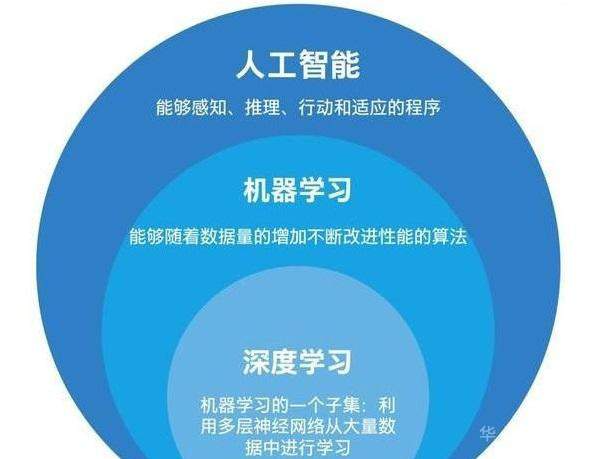
	-
		- 当前人工智能的主流方向是深度学习，因此深度学习之前的人工智能技术也被称为 GOFAI (Good old fashioned AI)。
	- ### 名词解释
		- 人工智能：专注于研究和构建智能体（intelligent agent）。
			- 智能体(agent)：能以智能方式行事，感知环境并自主实现目标，可以通过学习和知识来提高效果。
		- 机器学习：专注于构建根据数据进行学习或改进性能的系统。
			- Tom Michell: A computer program is said to learn from experience E with respect to some class of tasks T and performance measure P, if its performance at tasks in T, as measured by P, improves with experience E.
			- 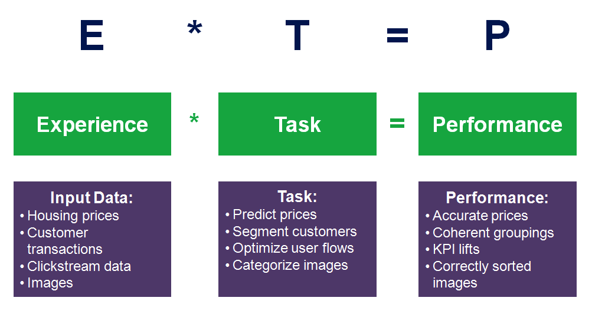
		- 深度学习：利用深度神经网络技术构建机器学习系统。
		- 其他更多[[人工智能名词解释]]
	- ### 人工智能学派
		- 符号主义：符号主义认为所有的知识和推理都可以用符号和逻辑来表示，即使用“if-then”这种大量的规则来定义，产生决策和推理。典型的代表如专家系统。在人工智能的早期，很多人工智能的权威级人物都推崇符号主义，比如麦卡锡、司马贺等人。
		- 连接主义：连接主义希望模仿人类大脑，通过模型人类的大脑神经网络来通过连接学习并存储知识。代表人物有罗森布拉特、辛顿。神经网络是连接主义的代表系统。
		- 行为主义：模拟人类的身体和行为，主要应用领域是机器人、自动驾驶等领域。
- ## 人工智能历史
- 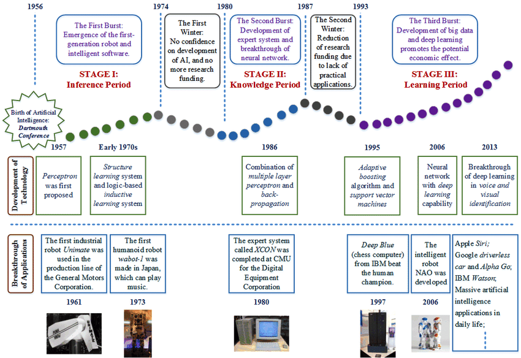
- ### 第一波浪潮：推理期
- 早起的人工智能研究是通过人类经验和逻辑归纳一些规则，通过编写计算机程序来完成特定任务。
- 1950年，人工智能的概念最早由图灵提出，他在《计算机器与智能》中提出“图灵测试”这一思想实验，即：如果一个人向另外一个人和一台机器（提问者不能看见被回答人和机器）同时发问，如果在多轮问答后他无法分辨谁是人谁是机器，那可以认为这台机器通过了图灵测试，也可以认为这台机器具备了智能。
- 1956年，约翰·麦卡锡、马文·明斯基、香农等人发起了达特茅斯会议，在这次会上首次提出“人工智能”一词。
- 1959年，第一台工业机器人诞生，能够通过存储信息完成操作步骤。
- 1964年，首台聊天机器人诞生。
- ### 第一次AI寒冬（1974-1980）
- 人工智能在五六十年代的发展让人们盲目乐观，甚至有学者认为：“二十年内，机器将能完成人能做到的一切。”不过进入七十年代后，AI研究面临了计算能力不足、推理规则无法解决复杂性问题等困难，人们对AI的信心降低，经费投入不足，进入了第一次寒冬期。
- ### 第二波浪潮：知识期
- 1980年开始，专家系统带动了新的一轮人工智能热潮。这一时期AI领域专家意识到知识库对于人工智能的重要性，人们对AI的研究转向了构建知识库，因此出现了各种各样的专家系统。专家系统即知识库+规则推理。比如IBM的Watson机器人。
- 1965年，第一个专家系统DENDRAL诞生，应用在推断有机化合物的分子结构。
- 1980年，美国人工智能协会(AAAI)成立。
- ### 第二次AI寒冬（1987-1993）
- 个人电脑的兴起让AI领域的金主美国国防部对AI失去了兴趣，对AI的投资减少，AI也进入了第二次寒冬。
- ### 第三波浪潮：学习期
- 这一时期AI的研究方向转为基于神经网路的机器学习，以深度神经网络为代表的连接主义站上了AI的舞台。
- 1997年，IBM深蓝机器人战胜国际象棋冠军卡斯帕罗夫。
- 2006年，辛顿发表论文，提出深度信念网络，基于神经网路的深度学习开始成为机器学习的最热门方向。
- 2016年，AlphaGo战胜李世石；次年，战胜围棋世界排名第一人柯洁。
- 2022年11月，OpenAI发布ChatGPT，掀起了AIGC的技术浪潮。
-
-
- ## 神经网络和深度学习
- 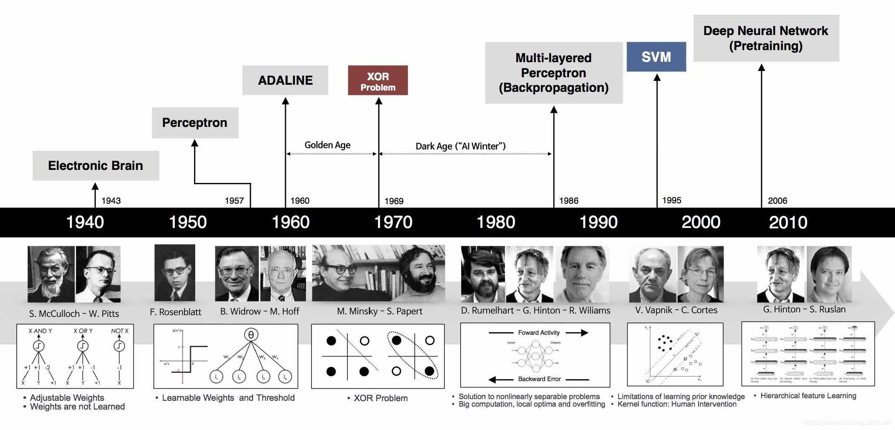
- ### 1、模型提出期（1943-1969）
- 1943年，麦卡洛克和皮茨提出了“神经网络”概念，并提出神经元逻辑计算模型——M-P模型：
- 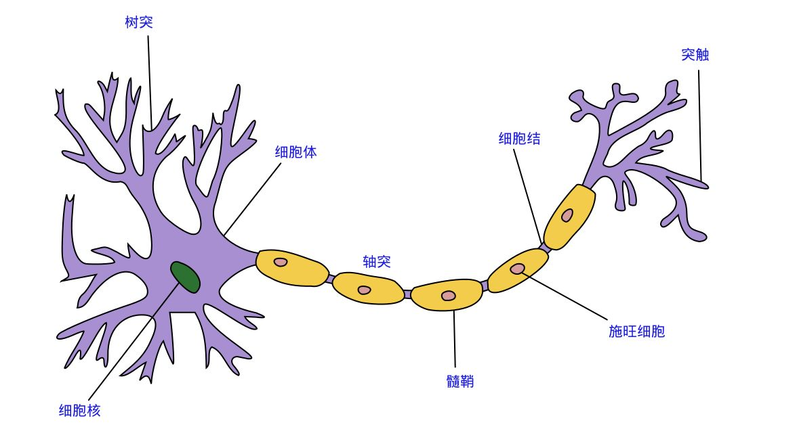
- 通过对人类大脑神经元的研究：一个神经元具备多个树突，主要用来接收传入信息，经过一系列计算（细胞核）最终将信号传入轴突，轴突只有一条，轴突尾端通过多个突触将信号传给其他神经元。
- 因此可以通过逻辑门方式构造一个人工神经元：
- 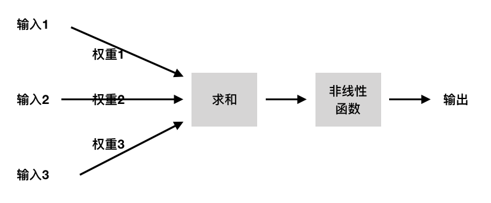
-
-
- 1957年，罗森布拉特扩展了M-P模型提出了感知机神经网络模型，并在两年后构建了感知机Mark1，可以识别一些英文字母。
- 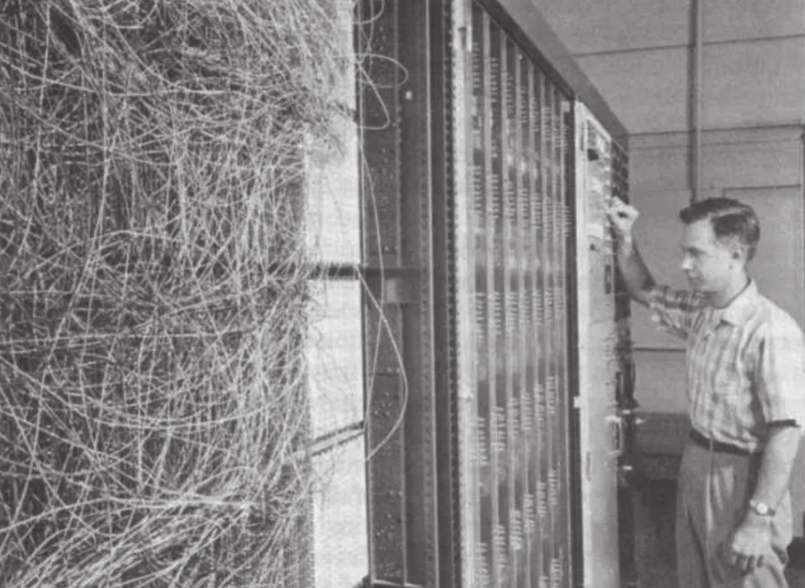
- 罗森布拉特设计的感知机为一层感知机，即除了输入层和输出层，中间层为一层神经网络。对于中间层中的每个神经元，接收多个输入信号(x)，每个信号有权重(w)，神经元计算输入信号的总和(x*w)，当总和超过设定阈值(θ)时，神经元被激活，输出1。
- 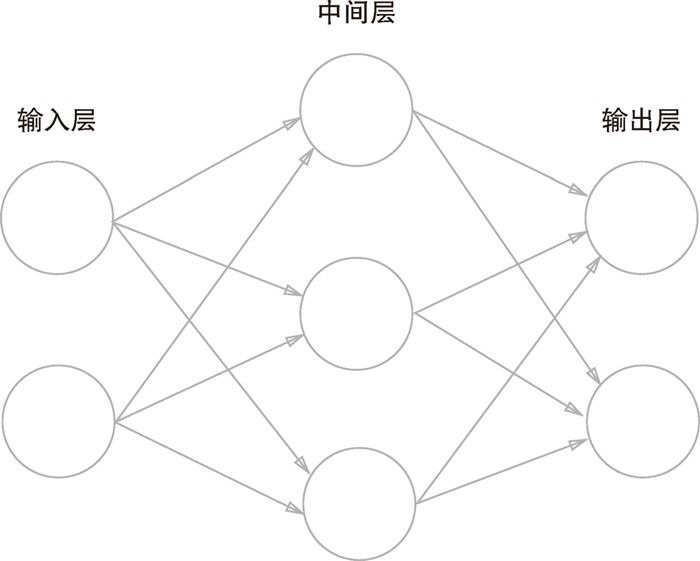
-
- 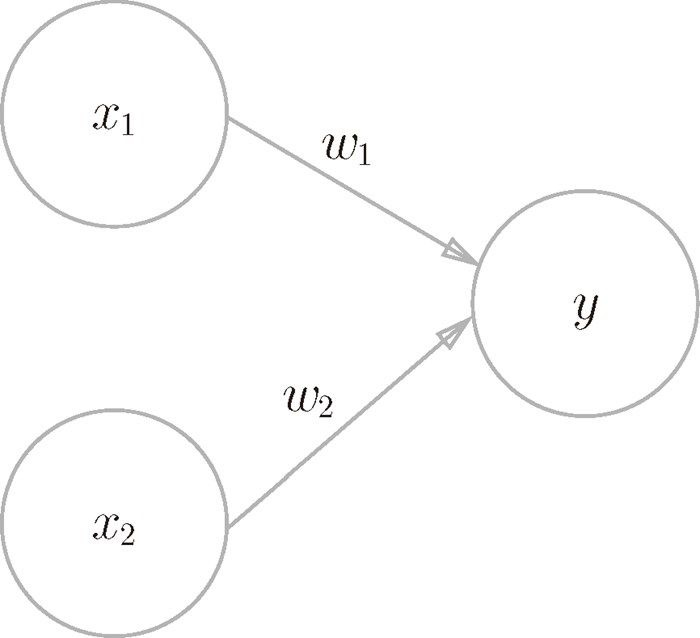
-
- ### 2、冰河期（1969-1983）
- 1969年，马文·明斯基出版《感知机》一书，指出感知机的两大问题：1、不能处理异或问题，也就是说感知机是一个线性模型，只能处理简单的线性分类问题，对于XOR异或这种简单的非线性问题都无法解决；2、当时的计算机能力无法支持处理大型神经网络问题所需的算力。由于马文·明斯基的江湖地位和影响力，这本书的出版导致人们对感知机及神经网络的质疑，神经网络进入了十年多的冰河期，在学术界不被看好。
- 这段时期内出现了一些神经网络的重要算法，比如1974年的反向传播算法（BackPropagation, BP）。
- 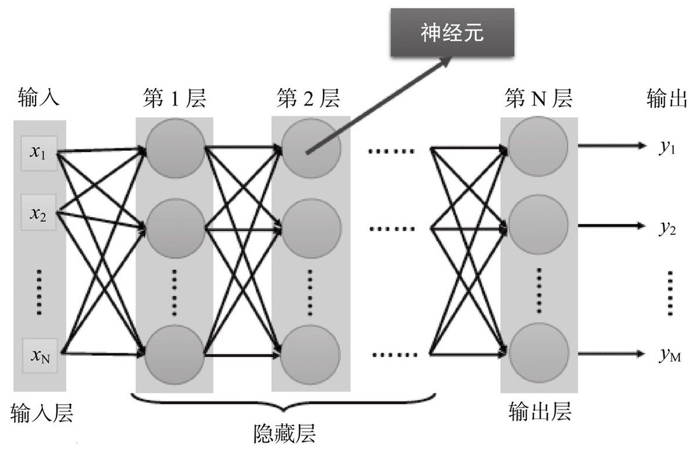
- ### 3、复兴期（1983-1995）
- 80年代，霍普菲尔德提出霍普菲尔德神经网络（HNN），这是一种全互联的反馈神经网络，通过输出到输入的激励，输出会产生不断地状态变化。这种方式使得“训练”神经网络成为可能。（根据赫布定律：简单的神经网络也能存储复杂的记忆，只需要一次次在神经网络上“暴露”相关信息。--> 参见  [[生命3.0]]）
- 1986年，辛顿发明了适用于多层感知机的BP算法，采用Sigmoid激活算法，有效解决了非线性分类和学习问题，引发了神经网络的第二次热潮。
- 反向传播算法开始在神经网络的一些模型中流行；1989年，燕乐存（Yann LeCun，或翻译为杨立昆）将反向传播算法引入卷积神经网络，在手写数字识别上取得成功。
- ### 4、第二次低潮（1995-2006）
- 引起第二次低潮的一个原因是BP算法存在的梯度消失问题：在误差反向传播过程中，后层梯度叠加到前层，由于Sigmoid函数的饱和特性，后层梯度本来就小，导致误差传递到前层时几乎为0，因此无法对前层进行有效的学习。 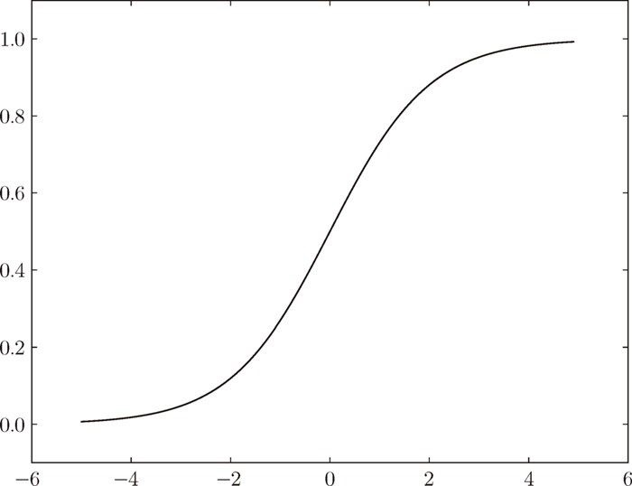
- 第二个原因是90年代中期，支持向量机（SVM）等算法兴起，但它是以统计学为基础，非神经网络算法，对神经网络的发展产生了抑制效应。
-
- ### 5、深度学习崛起（2006-）
- 2006年，辛顿提出深度信念网络模型，提出深度神经网络训练中的梯度消失问题的解决方案，开启了深度学习浪潮。
- 2011年，ReLU激活函数提出，有效抑制梯度消失问题。 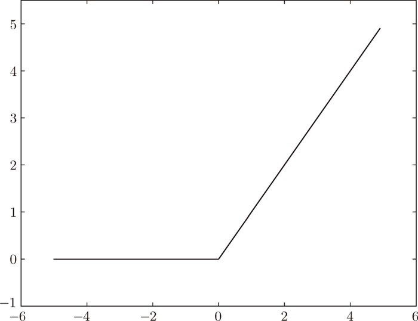
- 2012年，辛顿和他的两个学生使用深度学习构建AlexNet参加ImageNet大赛，一举夺冠。引发业界对深度学习的关注。
-
-
- ## 如何理解深度神经网络
- [[理解深度神经网络]]
- [[深度神经网络的数学表示]]
-
- ### 参考或引用图片等资料来源：
- 《[[智慧的疆界]]》
- 《[[深度学习革命]]》
- 《[[生命3.0]]》
- 《人工智能：现代方法》
- 《[[深度学习入门：基于Python的理论与实现]]》
- 《[[Python深度学习（第二版）]]》
- AI：人工智能概念之AI的发展历史图集合、AI发展思维导图之详细攻略 https://bbs.huaweicloud.com/blogs/255265
- 人工智能发展简史 https://www.aminer.cn/ai-history
- 人工智能、机器学习与深度学习的区别与联系 https://bbs.huaweicloud.com/forum/thread-144781-1-1.html
- 人工智能的发展历史 https://winterwindwang.github.io/2021/04/27/dl_story.html
- 人工智能、机器学习、神经网络和深度学习的发展历程 http://www.braintechnews.com/rgzn/20211223/230.html