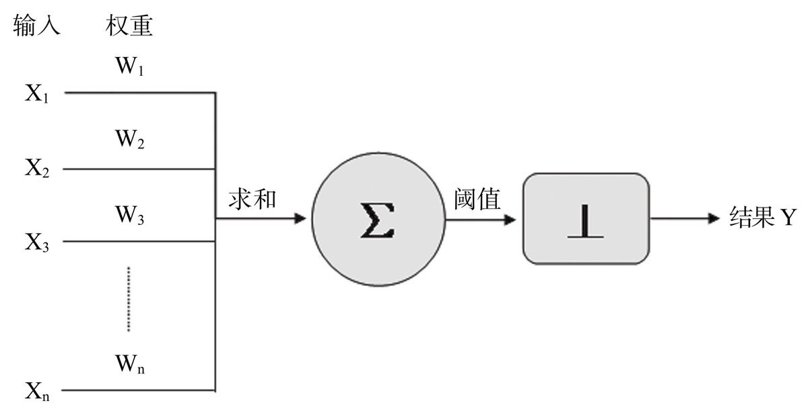

## 简介
	- ### 关系
		- 人工智能、机器学习和深度学习的关系如下：
	- ### 名词解释
		- 人工智能：专注于研究和构建智能体（intelligent agent）。
			- 智能体(agent)：能以智能方式行事，感知环境并自主实现目标，可以通过学习和知识来提高效果。
		- 机器学习：专注于构建根据数据进行学习或改进性能的系统。
			- Tom Michell: A computer program is said to learn from experience E with respect to some class of tasks T and performance measure P, if its performance at tasks in T, as measured by P, improves with experience E. 
		- 深度学习：利用深度神经网络技术构建机器学习系统。
	- ### 人工智能学派
		- 符号主义：符号主义认为所有的知识和推理都可以用符号和逻辑来表示，即使用“if-then”这种大量的规则来定义，产生决策和推理。典型的代表如专家系统。在人工智能的早期，很多人工智能的权威级人物都推崇符号主义，比如麦卡锡、司马贺等人。
		- 连接主义：连接主义希望模仿人类大脑，通过模型人类的大脑神经网络来通过连接学习并存储知识。代表人物有罗森布拉特、辛顿。神经网络是连接主义的代表系统。
		- 行为主义：模拟人类的身体和行为，主要应用领域是机器人、自动驾驶等领域。
- ## 人工智能历史
- ### 第一波浪潮：推理期
- 早起的人工智能研究是通过人类经验和逻辑归纳一些规则，通过编写计算机程序来完成特定任务。
- 1950年，人工智能的概念最早由图灵提出，他在《计算机器与智能》中提出“图灵测试”这一思想实验，即：如果一个人向另外一个人和一台机器（提问者不能看见被回答人和机器）同时发问，如果在多轮问答后他无法分辨谁是人谁是机器，那可以认为这台机器通过了图灵测试，也可以认为这台机器具备了智能。
- 1956年，约翰·麦卡锡、马文·明斯基、香农等人发起了达特茅斯会议，在这次会上首次提出“人工智能”一词。
- 1959年，第一台工业机器人诞生，能够通过存储信息完成操作步骤。
- 1964年，首台聊天机器人诞生。
- ### 第一次AI寒冬（1974-1980）
- 人工智能在五六十年代的发展让人们盲目乐观，甚至有学者认为：“二十年内，机器将能完成人能做到的一切。”不过进入七十年代后，AI研究面临了计算能力不足、推理规则无法解决复杂性问题等困难，人们对AI的信心降低，经费投入不足，进入了第一次寒冬期。
- ### 第二波浪潮：知识期
- 1980年开始，专家系统带动了新的一轮人工智能热潮。这一时期AI领域专家意识到知识库对于人工智能的重要性，人们对AI的研究转向了构建知识库，因此出现了各种各样的专家系统。专家系统即知识库+规则推理。比如IBM的Watson机器人。
- 1965年，第一个专家系统DENDRAL诞生，应用在推断有机化合物的分子结构。
- 1980年，美国人工智能协会(AAAI)成立。
- ### 第二次AI寒冬（1987-1993）
- 个人电脑的兴起让AI领域的金主美国国防部对AI失去了兴趣，对AI的投资减少，AI也进入了第二次寒冬。
- ### 第三波浪潮：学习期
- 这一时期AI的研究方向转为基于神经网路的机器学习，以深度神经网络为代表的连接主义站上了AI的舞台。
- 1997年，IBM深蓝机器人战胜国际象棋冠军卡斯帕罗夫。
- 2006年，辛顿发表论文，提出深度信念网络，基于神经网路的深度学习开始成为机器学习的最热门方向。
- 2016年，AlphaGo战胜李世石；次年，战胜围棋世界排名第一人柯洁。
- 2022年11月，OpenAI发布ChatGPT，掀起了AIGC的技术浪潮。
- 
-
- ## 神经网络和深度学习
-
- ### 1、模型提出期（1943-1969）
- 1943年，麦卡洛克和皮茨提出了“神经网络”概念，并提出神经元逻辑计算模型——M-P模型：
- 
- 1957年，罗森布拉特扩展了M-P模型提出了感知机神经网络模型，并在两年后构建了感知机Mark1，可以识别一些英文字母。
- 
-
- ### 2、冰河期（1969-1983）
- 1969年，马文·明斯基出版《感知机》一书，指出感知机的两大问题：不能处理异或问题，计算机能力无法支持处理大型神经网络问题所需的算力。由于马文·明斯基的江湖地位和影响力，这本书的出版导致人们对感知机及神经网络的质疑，神经网络进入了十年多的冰河期，在学术界不被看好。
- 这段时期内出现了一些神经网络的重要算法，比如1974年的反向传播算法（BackPropagation, BP）。
- ### 3、复兴期（1983-1995）
- 反向传播算法开始在神经网络的一些模型中流行；1989年，燕乐存（Yann LeCun）将反向传播算法引入卷积神经网络，在手写数字识别上取得成功。
- 
-
	- ### 神经网络
-
-
-
- ### 参考或引用图片等资料来源：
- 《[[智慧的疆界]]》
- 《深度学习革命》
- 《人工智能：现代方法》
- 《[[深度学习入门：基于Python的理论与实现]]》
- 《[[Python深度学习（第二版）]]》
- AI：人工智能概念之AI的发展历史图集合、AI发展思维导图之详细攻略 https://bbs.huaweicloud.com/blogs/255265
- 人工智能发展简史 https://www.aminer.cn/ai-history
- 人工智能、机器学习与深度学习的区别与联系 https://bbs.huaweicloud.com/forum/thread-144781-1-1.html
- 人工智能的发展历史 https://winterwindwang.github.io/2021/04/27/dl_story.html
- 人工智能、机器学习、神经网络和深度学习的发展历程 http://www.braintechnews.com/rgzn/20211223/230.html