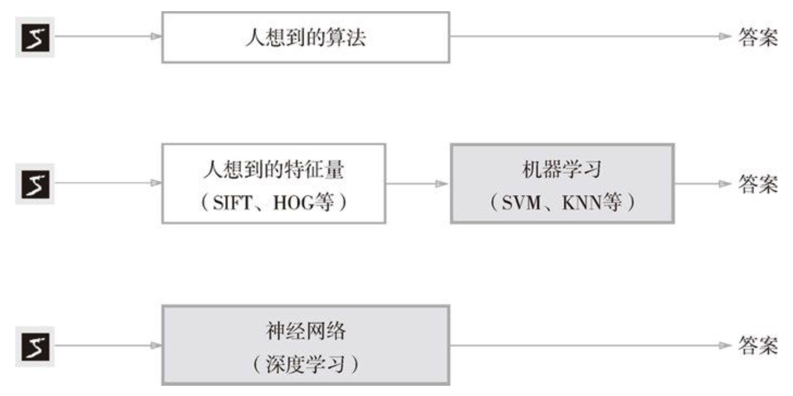
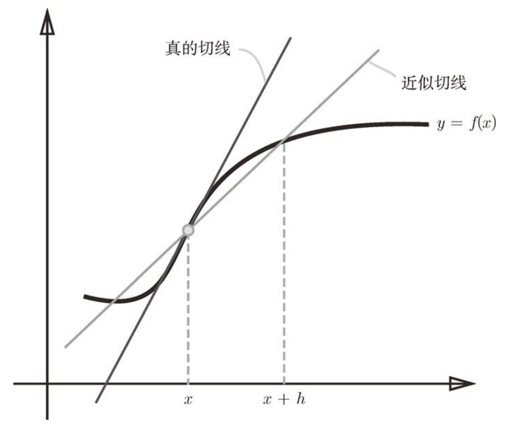
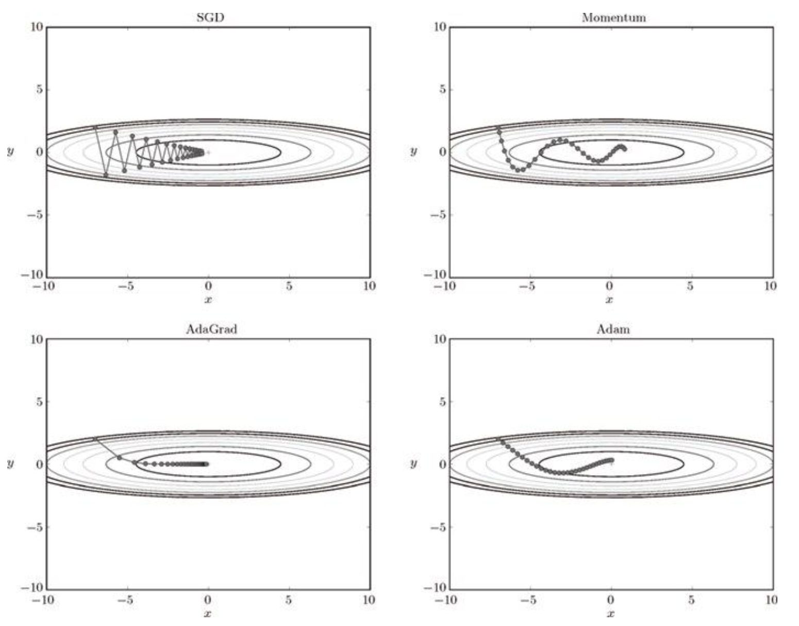
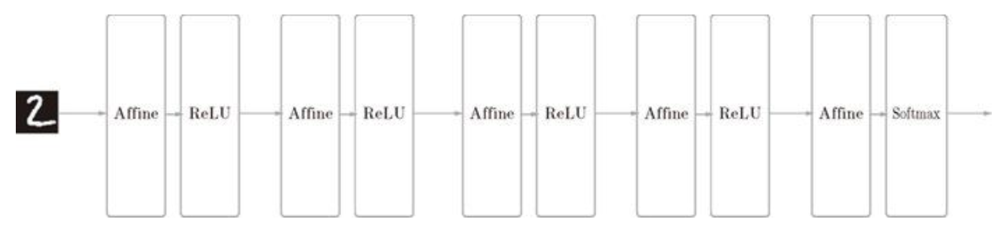
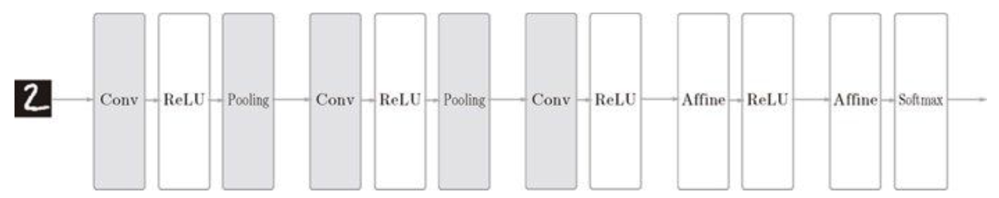

- #人工智能
- 一维数组：向量；二维数组：矩阵；三维及以上数组：张量
- ## 感知机：
	- 1957年由罗森布拉特(Frank Rosenblatt)提出。
	- 定义：接收多个输入信号(x)，每个信号有权重(w)，神经元计算输入信号的总和(x*w)，当总和超过设定阈值(θ)时，神经元被激活，输出1。感知机可以表示为如下数学公式：
	- ```
	  $$
	  y=
	  \begin{cases}
	  0 & \quad \text{$(w_1 \times x_1+w_2 \times x_2 \leq \theta)$}\\
	  1 & \quad \text{$(w_1 \times x_1 + w_2 \times x_2 > \theta)$}
	  \end{cases}
	  $$```
	- 可以将阈值 $\theta$ 移到公式左边换成 -b，这里的b即**偏置**:
	- ```
	  $$
	  y=
	  \begin{cases}
	  0 & \quad \text{$(b+w_1 \times x_1+w_2 \times x_2 \leq 0)$}\\
	  1 & \quad \text{$(b+w_1 \times x_1 + w_2 \times x_2 > 0)$}
	  \end{cases}
	  $$```
	- 感知机的实现：与门、与非门、或门；但感知机无法表示异或门。用线性图可以看出，无法画出分割异或门的直线。对此，解决的方案是使用两层感知机来进行组合，即多层感知机。
- ## 神经网络：
	- 神经网络： 输入层 --> 中间层（隐藏层） --> 输出层
	- 对于上文中的公式，引入一个新函数h(x)来简化：$y=h(b+w_1 \times x_1 + w2 \times x_2)$ ，简化后的公式为，这个新函数就是激活函数：
	- ```
	  $$ h(x)=
	  \begin{cases}
	  0 & \quad \text{$(x \leq 0)$}\\
	  1 & \quad \text{$(x > 0)$}
	  \end{cases}
	  $$```
	- h(x) 会将输入信号的总和转换为输出信号，这种函数被称为 **激活函数**。
		- 上述例子中的激活函数可称为阶跃函数
		- 神经网络中经常使用的一个激活函数是 sigmoid 函数(sigmoid function): $h(x)=\dfrac{1}{1+e^{-x}}$
		- 从阶跃函数和sigmoid函数的图形可以看出，阶跃函数以0为界限，输出根据输入急剧变化；而sigmoid函数的输出是平滑的连续性变化。这两个函数都是非线性函数。
			- ReLU函数也是神经网络常用的激活函数：当输入大于0时，直接输出该值；当输入小于等于0时，则输出0。
			  $$ h(x)=
			  \begin{cases}
			  x & \quad \text{$(x > 0)$}\\
			  0 & \quad \text{$(x \leq 0)$}
			  \end{cases}
			  $$
		- 输出层激活函数的选择：一般情况下，回归问题可以使用恒等函数，二元分类问题可以使用sigmoid函数，多元分类问题可以使用softmax函数。
			- 机器学习的问题大致可以分为分类问题和回归问题。分类问题是判断数据属于哪一类别的问题，比如识别图像是猫还是狗之类；而回归问题是根据一个输入预测一个（连续的）数值的问题，比如根据一个人的图像预测该人的体重。
			- 恒等函数会将输入原样输出，即输出层会将输入层的信号原封不动的输出。 $$f(x) = x$$
			- softmax函数表示：
	- 多维数组运算
		- 使用numpy表示多维数组： np.array
		- 矩阵乘法：左边矩阵的行和右边矩阵的列以对应元素的方式相乘再求和而得到。
			- 在矩阵的乘积运算中，对应维度的元素个数要保持一致
		- 神经网络的内积：使用矩阵来表示神经网络（数值为权重）
	- 三层神经网络的实现
		- 输出层的设计：
			- 激活函数：回归问题用恒等函数，分类问题用softmax函数
	- 案例：手写数字识别
		- MNIST数据集：由0-9数字图像构成，训练图像由6万张，测试图像有1万张，用于学习和推理。MNIST的图像数据是28像素*28像素的灰度图像（1通道），各个像素的取值在0-255之间。
		- 神经网络的推理处理：对MNIST数据集进行神经网络设计，该神经网络输入层有784个神经元（28*28=784），输出层有10个神经元（0-9共10个类别的数字），有两个隐藏层：第1个50个神经元，第2个100个神经元。（这两层的神经元个数（50和100）可以设计成任何值。）
		- 批处理：如果将预测函数一次性打包处理100张图像，那么这种打包式的输入数据就称为 批（batch）
			- 批处理可以大幅缩短每张图像的处理时间
- ## 神经网络的学习
	- 神经网络的特征是从数据中学习，即可以由数据自动决定权重参数的值。
		- 
	- 训练数据和测试数据：
		- 使用训练数据进行学习，使用测试数据评价训练得到的模型的实际能力，训练数据也可以称为监督数据
	- ### 损失函数：
		- 神经网络学习中所使用的指标称为损失函数（loss function），可以使用任意函数，但一般使用均方误差和交叉熵误差等。
			- 均方误差公式：
				- $$E = \dfrac{1}{2}\sum(y_k-t_k)^2$$
			- 交叉熵误差公式：
				- $$E=-\sum_{k}(t_k\log{y_k})$$
	- ### 数值微分
		- 导数
			- 导数就是表示某个瞬间的变化量，导数可以定义为：
				- $$\dfrac{df(x)}{dx} = \lim_{h \to 0}\dfrac{f(x+h) - f(x)}{h}$$
				- 其中，等号左边符号表示 f(x) 关于 x 的导数，即 f(x) 相对于 x 的变化程度。$$\lim_{h \to 0}$$表示微小变化的h无限趋近于0
		- 数值微分（numerical differentiation）： 就是用数值方法近似求解函数的导数的过程
			- 用程序来表示求函数的导数：
			- ```
			  def numerical_diff(f, x):
			  	h = 10e-50
			      return (f(x+h) - f(x)/h)
			  ```
			- 对程序的两个改进点：
				- 1. 由于10e-50太小，反而会产生舍入误差，变成0.0，因此，在程序里可将h设置为 10e-4;
				- 2. 如下图所示，“真的导数”对应函数在x处的斜率（切线），但上述数值微分计算的导数对应的是 (x+h)和x 之间的斜率。由于h不可能无限接近于0，因此真的导数（真的切线）和数值微分（近似切线）的值不同。为了减小这一误差，可以计算(x+h)和(x-h)之间的差分，以x为中心，计算它左右的差分，这也称为**中心差分**。（ (x+h)和x之间的差分称为**前向差分**）
				- {:height 593, :width 688}
			- 综上: 利用微小的差分求导数的过程称为 **数值微分**(numerical differentiation)； 而基于数学式的推导求导的过程是**解析性求导**(analytic derivation)，后者得到的是“真的导数”。
		- 偏导数
			- 有多个变量的函数的导数称为偏导数，例如函数：
			- $$f(x_0, x_1) = x_0^2 + x_1^2$$
			- 因为该函数有两个变量，需要区分是对哪个变量求导数，这种对多个变量的函数求求导数称为求偏导数。而如何求偏导数? 试着将 $x_0$ 或 $x_1$ 设置一个固定值，然后对函数的求导。
			- 偏导数也是求某个地方的斜率，只不过，偏导数需要将多个变量中的某一个变量定为目标变量，并将其他变量固定为某个值。
	- ### 梯度
		- 上面例子中，求 $x_0 = 3$, $x_1 = 4$ 时 $(x_0, x_1)$ 的偏导数 $(\dfrac{\partial f}{\partial x_0}, \dfrac{\partial f}{\partial x_1})$。像$(\dfrac{\partial f}{\partial x_0}, \dfrac{\partial f}{\partial x_1})$这种由全部变量的偏导数汇总而成的向量称为梯度（gradient）
		- 梯度法：函数的取值从当前位置沿着梯度方向前进一定距离，然后在新的地方重新求梯度，在沿着新梯度方向前进，如此反复，不断地沿梯度方向前进。这种逐渐减小函数值的过程就是梯度法（gradient method）。
			- 寻找最小值的梯度法称为梯度下降法（gradient descent method）
			- 寻找最大值的梯度法称为梯度上升法（gradient ascent method）
			- 用数学公式来表示梯度法，如下：
				- $$ x_0 = x_0 - \eta\dfrac{\partial f}{\partial x_0} $$
				- $$x_1 = x_1 - \eta\dfrac{\partial f}{\partial x_0} $$
			- $\eta$ 表示更新量，在神经网络学习中，称为 学习率（learning rate）
			- 像学习率这种参数称为 **超参数**，与神经网络的参数（权重和偏置）性质不同。权重参数是通过训练自动获得，而超参数则是人工设定。
		- 神经网络的梯度
			- 神经网络学习的梯度指的是损失函数关于权重参数的梯度。
	- ### 学习算法的实现
		- 神经网络存在合适的权重和偏置，而调整权重和偏置以便拟合训练数据的过程称为“学习”，神经网络的学习分成4个步骤：
			- 1、 mini-batch：从训练数据中随机选出一部分数据
			- 2、计算梯度：为了减小mini-batch的损失函数的值，需要求出各个权重参数的梯度
			- 3、更新参数：将权重参数沿梯度方向进行微小更新
			- 4、重复：重复步骤1、2、3
		- 这个方法通过梯度下降法更新参数，因为使用的数据是随机选择的min-batch数据，因此又称为 **随机梯度下降算法**(stochastic gradient descent)
		- 用python实现一个手写数字识别的神经网络：以2层神经网络（1个隐藏层）为对象，使用MNIST数据集进行学习
			- 2层神经网络的类
			- 实现 mini-batch
- ## 误差反向传播算法
	- 如何理解误差反向传播算法，可以通过数学公式，或者通过计算图
	- ### 计算图
		- computational graph
		- 从左到右进行计算：正向传播 forward propagation
		- 从右到左进行计算：反向传播 backward propagation
	- ### 链式法则
		- 复合函数：由多个函数构成的函数
		- 如果某个函数由复合函数表示，则该复合函数的导数可以用构成复合函数的各个函数的导数的乘积表示。
	- ### 反向传播
		- 加法节点的反向传播：将上游值原封不动的输出到下游
			- 如何理解? 对于函数 $$z = x+y$$, 偏导数为：
				- $$ \dfrac{\partial z}{\partial x} =1 $$
				- $$ \dfrac{\partial z}{\partial y} =1 $$
				- 它们的导数为1，因此加法节点的反向传播只乘以 1， 也就是输入值本身
		- 乘法节点的反向传播：将上游的值乘以正向传播时的输入信号的“翻转值”后传递给下游。
			- 如何理解？对于函数 $$z = x\times y $$，偏导数为：
				- $$ \dfrac{\partial z}{\partial x} =y $$
				- $$ \dfrac{\partial z}{\partial x} =x $$
				- 因此乘法节点的反向传播乘以“翻转值”
	- ### 简单层的实现
		- 将乘法节点称为 乘法层(MulLayer)，将加法节点称为 加法层(AddLayer)
		- 实现两个共通方法 forward() 和 backward()
	- ### 激活函数层的实现
		- 激活函数 ReLU层 和 Sigmoid层
		- 也分别实现 forward() 和 backward()
	- ### Affine/Softmax 层的实现
		- ……
	- ### 误差反向传播算法实现
		- ……
- ## 与学习相关的技巧
	- ### 参数的更新
		- 神经网络学习的目的是找到使损失函数的值尽可能小的参数，这个寻求最优参数的过程就是 **最优化**(optimization)。而使用的方法，除了前面说的**随机梯度下降法**(SGD)，还有其他一些方法。
			- SGD的缺点：如果梯度的方向没有指向最小值的方向，那么SGD会很低效。
			- 优化方法：
				- Momentum
				- AdaGrad
				- Adam
			- 
		- ### 权重的初始值
			- 可以将权重初始值设置为0吗？不能。否则将无法正确学习。为了防止“权重均一化”，必须随机生成初始值。
			- 隐藏层的激活值的分布：要有适当的广度
			- ReLU的权重初始值：……
		- ### Batch Normalization
			- Batch Norm 是 2015年提出的算法。它的思路是调整各层的激活值分布使其拥有适当的广度，因此，要向神经网络中插入Batch Norm层对数据分布进行正规化。
		- ### 正则化
			- 机器学习中，过拟合很常见，主要原因是：1）模型有用大量参数、表现力强；2)训练数据少
			- 权值衰减：用来抑制过拟合的一种方法，该方法通过在学习过程中对大权重进行惩罚，来抑制过拟合
			- Dropout: 另一种抑制过拟合的方法，在学习过程中随机删除神经元的方法。
		- ### 超参数的验证
			- 需要人工设置的参数称为超参数，比如各层神经元的数量、batch大小、学习率等。
			- 使用验证数据（validation data）来评估超参数的好坏
			- 超参数的最优化：步骤：
				- 0、设定超参数范围
				- 1、从设定的超参数范围中随机采样
				- 2、使用步骤1中采样到的超参数的值进行学习，通过验证数据评估识别精度
				- 3、重复1、2，根据识别精度的结果，缩小超参数的范围
			-
- ## 卷积神经网络
	- 卷积神经网络 Convolutional Neural Network CNN
	- ### 整体结构
		- CNN中增加了卷积层（Convolution）和池化层（Pooling）
		- 在神经网络中，相邻层的所有神经元之间都有连接，称为**全连接**(fully-connected)，一个全连接的神经网络的例子：
		- 
		- CNN中增加卷积层和池化层，（池化层有时被省略）：即"Affine - ReLU"连接被替换成了"Convolution - ReLU - (Pooling)"连接。靠近输出层仍使用 "Affine - ReLU"，输出层使用 "Affine - Softmax"
		- 
	- ### 卷积层
		-
-