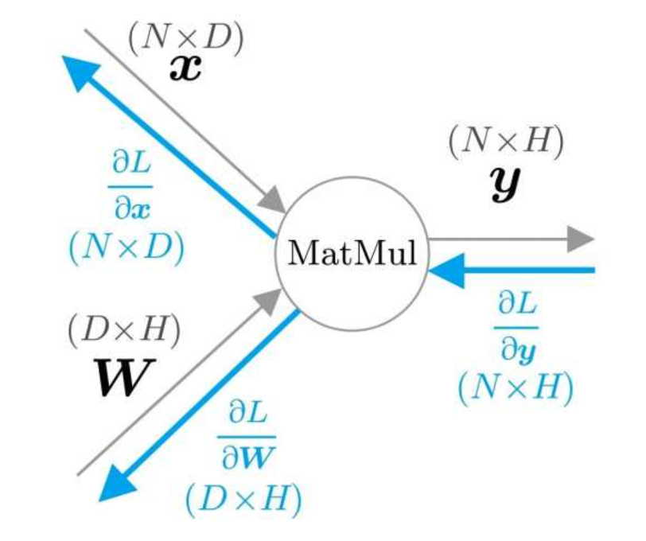

# 神经网络的复习
	- ## 数学和Python
		- 向量和矩阵、张量
		- 矩阵运算
		- 广播
	- ## 神经网络的推理
		- 神经网络的例子
			- {:height 373, :width 629}
			- 每个神经元（图中O型节点）的输入是与它连接的上一层神经元的输出值与权重（与连接的两个神经元有关）相乘，并累加，再加上偏置（与上一层神经元无关）；这个值，再经过激活函数转换，成为该神经元的输出值。如下公式(x代表输入层的数据，w代表权重，b代表偏置)：
				- $$ h_1 = x_1w_{11} + x_2w_{21} + b_1 $$
				- 使用 sigmoid激活函数进行变换：
				- $$ a = sigmoid(h) $$
			- 联想：神经网络的推理所进行的处理相当于神经网络的正向传播；神经网络的学习则是反向传播。
				- 将神经网络的层实现为Python 类：
					- 所有的层都有 forward() 方法和 backward() 方法
					- 所有的层都有 params 和 grads 实例变量
				- 神经网络层结构：
				- 
	- ## 神经网络的学习
		- 损失函数
			- 在神经网络的学习中，为了知道学习的如何，需要一个指标，这个指标就是损失(loss)。
			- 计算神经网络的损失要用到损失函数(loss function)，进行多类别分类的神经网络通常使用交叉熵误差(cross entropy error)作为损失函数。
			- 
			- 可以将 Softmax 函数和 交叉熵误差的层实现为 Softmax with Loss 层：
			- 
		- 导数和梯度：
			- 导数相当于函数的斜率
			- 将向量的各个元素的导数罗列在一起，就得到了梯度
		- 链式法则：
			- 理解误差反向传播法的关键是链式法则，链式法则是复合函数的求导法则，即复合函数的导数之积。
		- 计算图
			- 使用计算图，可以直观的把握计算过程。
		- 使用计算图对各种节点的正向传播和反向传播进行计算：
			- 加法节点
				- 
			- 乘法节点
				- 
			- 分支节点
				- 
			- Repeat 节点
				- 
			- Sum节点
				- 
			- MatMul节点（Matrix Multiply）
				- 
				- 
		- 神经网络的学习步骤:
			- 步骤1：mini-batch
			- 步骤2：计算梯度
			- 步骤3：更新参数
			- 步骤4：重复1-3
		- 权重更新方法有很多，常见的有 随机梯度下降算法（SGD, Stochastic Gradient Descent）
	- ## 使用神经网络解决问题
	- ## 计算的高速化
		- 位精度：32位浮点数比64位浮点数计算快，16位浮点数比32位浮点数计算快
		- GPU并行计算
-
- # 自然语言和单词的分布式表示
	- ## 自然语言处理
		- NLP = Natural Language Processing
	- ## 同义词词典
		- 同义词词典可以用来在信息检索场景，如 WordNet
		- 同义词典的问题:
			- 难以顺应时代变化
			- 人力成本高
			- 无法表达单词的微妙差异
	- ## 基于计数的方法
		- 语料库（corpus）：大量的文本数据
		- 如何将单词表示为向量?
			- 思考：如何表示颜色？比如可以通过名称来表示，比如钴蓝等，这样有多少种颜色，就需要多少种名字。还有一种更好的方式方法，使用RGB三原色表示，这样可以通过三维向量来表示颜色。
			- 在自然语言处理领域，将关注能准确把握单词含义的向量表示，称为**分布式表示**。
		- **分布式假设**：单词本身没有含义，单词含义由它所在的上下文（语境）形成。上下文的大小（即周围单词有多少个）称为窗口大小。如下面例子中，关于goodbye时，窗口大小为2的上下文:
			- 
		- 共现矩阵:
			- 例，对 'You say goodbye and I say hello.' 来进行向量表示，首先对它进行编ID:
			- {0: 'you', 1: 'say', 2: 'goodbye', 3: 'and', 4: 'i', 5: 'hello', 6: '.'}
			- 预设窗口大小为1，统计关注单词上下文出现的频数，如对say统计如下：
			- 
			- 单词say可以表示为向量 [1, 0, 1, 0, 1, 1, 0]，对所有单词进行处理：
			- 
			- 这种汇总所有单词的共现单词的形式，称为 共现矩阵 (co-occurence matrix)。有了这个矩阵，就可以获得各个单词的向量。
		- 向量间的相似度
			- 测量单词的向量表示的相似度方面，常用的方法有余弦相似度（cosine similarity）
	- ## 基于计数方法的改进
		- 点互信息
			- 共现矩阵存在的问题：比如某个语料中有很多 "...the car..."这样的短语，那么它们共现的次数将很大，如果只看单词共现次数，那the和car的相关性比 car和drive的相关性更强，显然是有问题的。
			- 为了解决这一问题，引入点互信息（Pointwise Mutual Information, PMI）这一指标：
				- $$PMI(x, y) = log_2\dfrac{P(x, y)}{P(x)P(y)}$$
			- P(x)表示x出现的概率，P(y)表示y出现的概率，P(x, y)表示x和y同时出现的概率。PMI值越高，表明相关性越强。上述例子中，由于 the 本身会出现很多，因此PMI值会被拉低。
			- PMI的问题：但当两词共现次数为0时， $$log_2=-infty$$，因此实际上会用正点互信息（Positive PMI, PPMI）:
				- $$PPMI(x, y) = max(0, PMI(x, y)$$
		- 降维
			- 降维（dimensionality reduction），就是减少向量维度。
			- 为什么要什么降维?
				- PPMI矩阵的问题是，随着语料库单词量增加，各单词向量的维度也会增加。但矩阵中很多元素都是0，因此说明向量中的绝大多数元素并不重要。因此需要使用一些降维方法来减少这种噪声：
					- 奇异值分解（Singular Value Decomposition, SVD）
- # word2vec
	- ## 基于推理的方法和神经网络
		- 用向量表示单词的方法大致有两种：基于计数的方法和基于推理的方法
		- 基于计数的方法的问题是语料库数据量大，生成共现矩阵过于庞大，执行SVD复杂度成比例增长。因此，替代的方法是基于推理的方法：该方法通常在mini-batch数据上学习，一次只需看一部分学习数据：
			- 
		- 基于推理的方法的主要操作是“推理”，根据上下文来预测 ？ 处会出现什么单词：
			- 
		- 从模型视角来看，就是输入上下文，模型输出各个单词的出现概率：
			- 
		- 在神经网络中处理单词的方法：
			- 先将单词转化为固定长度的向量（可以采用 one-hot向量表示，即只有一个元素是1，其他元素都是0）:
				- 
			- 神经网络输入层的神经元对应各个单词:
				- 
				- 
	- ## word2vec
		- 略
- # Word2vec 高速化
	- 略
- # RNN
	- 单纯的前馈神经网络无法充分学习时序数据的性质，因此，RNN（循环神经网络， RNN）应运而生。
	- RNN, Recurrent Neural Network
	- RNN拥有环路：
		- 
	- RNN层循环展开：
		- 
	- RNN通过数据的循环，从过去继承数据并传递到现在和未来。因此，RNN层内部获得了记忆隐藏状态的能力。
- # Gated RNN
	- ## RNN 的问题
		- 梯度消失和梯度爆炸
	- ## 梯度消失和LSTM
		- LSTM: Long Short-Term Memory 长短期记忆，也就是可以长时间维持短期记忆。
- # 基于RNN生成文本
	- ## 使用语言模型生成文本
		- 语言模型输出下一个出现的单词的概率分布：
			- 
	- ## seq2seq模型
		- 文本数据、音频数据、视频数据都是时序数据。
		- seq2seq模型也称为 Encoder-Decoder模型，顾名思义，这个模型有两个模块:Encoder（编码器）和Decoder（解码器）
			- 
		- 编码器和解码器协作，将一个时序数据转换为另一个时序数据。在这些编码器和解码器的内部可以使用RNN
	- # Attention
		- ## Attention的结构
			-