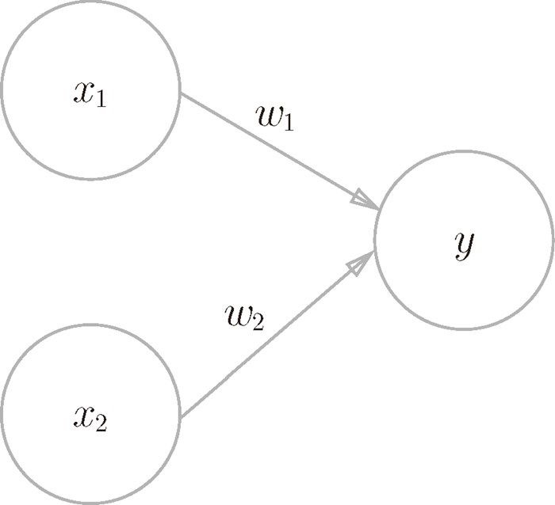

## 数学基础
	- [[神经网络的数学基础]]
- ## 感知机的数学表示
	- 定义：接收多个输入信号(x)，每个信号有权重(w)，神经元计算输入信号的总和(x*w)，当总和超过设定阈值(θ)时，神经元被激活，输出1。 
	- 感知机可以表示为如下数学公式：
	- ```
	  $$
	  y=
	  \begin{cases}
	  0 & \quad \text{$(w_1 \times x_1+w_2 \times x_2 \leq \theta)$}\\
	  1 & \quad \text{$(w_1 \times x_1 + w_2 \times x_2 > \theta)$}
	  \end{cases}
	  $$```
	- 可以将阈值 $\theta$ 移到公式左边换成 -b，这里的b即**偏置**:
	- ```
	  $$
	  y=
	  \begin{cases}
	  0 & \quad \text{$(b+w_1 \times x_1+w_2 \times x_2 \leq 0)$}\\
	  1 & \quad \text{$(b+w_1 \times x_1 + w_2 \times x_2 > 0)$}
	  \end{cases}
	  $$```
- ## 神经网络的数学表示
	- 矩阵表示神经网络
	-
- ## 神经网络的学习
	- ### 偏导数
	- ### 梯度下降算法
	- ### 反向传播算法
-