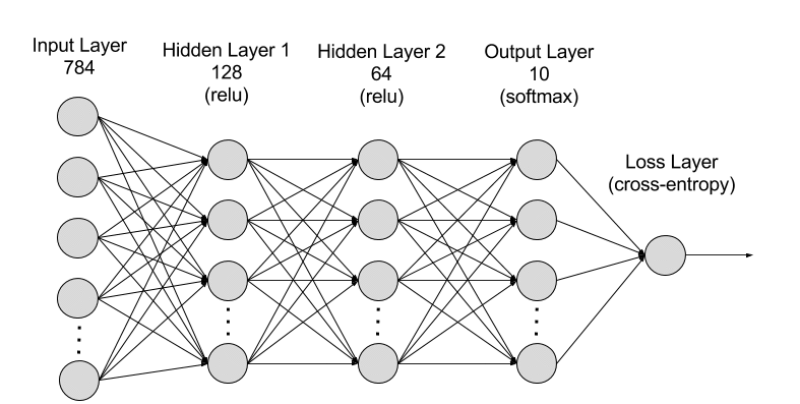
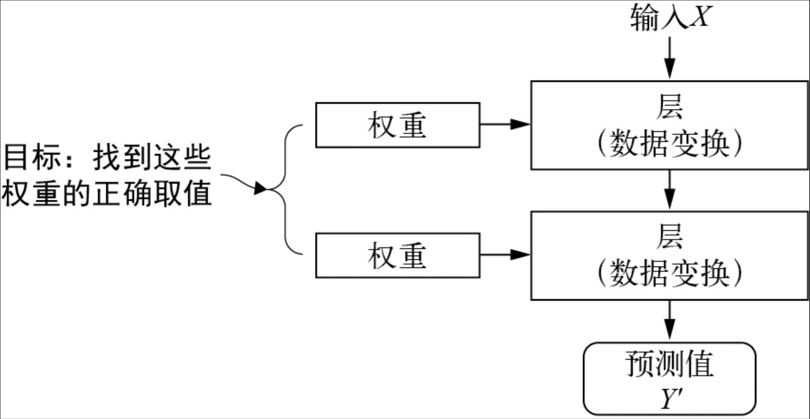
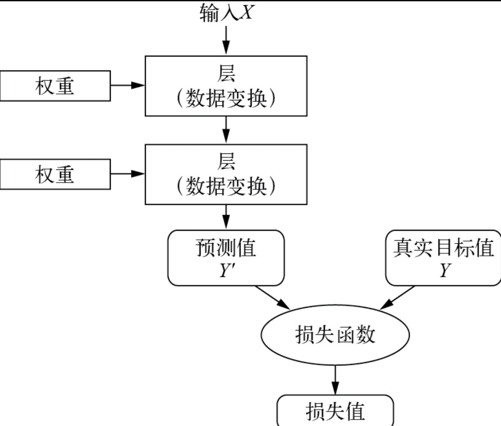
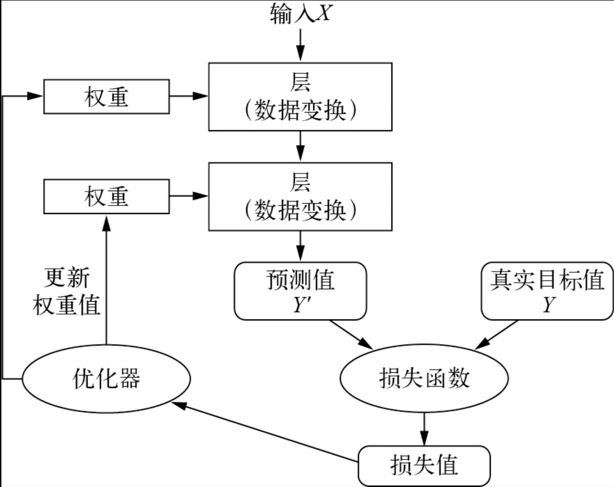

- 
-
- 1、在神经网络中，每一层对输入数据的具体操作保存在权重（一串数字）中，也就是说，每层实现的变换由其权重来完成参数化，因此，权重也被称为该层的参数。因此，神经网络的训练也就是要找到这些参数的正确取值。
	- 但问题是：一个神经网络包含千万甚至更多参数。（比如GPT-3包含1750亿参数，GPT-4据称包含1.8万亿参数）如何找到这些参数的正确取值？特别是一个参数值的修改可能影响其他所有参数。
	- {:height 411, :width 778}
- 2、如果要控制某事物，那首先要能够观察它。要控制神经网路的输出，那需要衡量该输出与预期结果之间的距离。神经网络称之为[[损失函数]]（loss function），或目标函数(objective function)，或代价函数（cost function），含义是一样的。
	- 
- 3、深度学习的基本技巧是将损失值作为反馈信号，来对权重值（参数）进行微调，以降低当前示例对立的损失值。这种调节是优化器（optimizer）的任务，它实现了所谓的反向传播（backpropagation）算法，也是深度学习的核心算法。
	- 
- 4、一开始，神经网络的参数随机赋值，其损失值很大。但，随着神经网络每处理一个示例，参数值都会向着正确的方向微调，损失值相应减小。这就是训练循环（training loop），这种循环足够多的此书，得到的参数值可以将损失函数最小化，这也就训练出了一个好的神经网络模型。
-