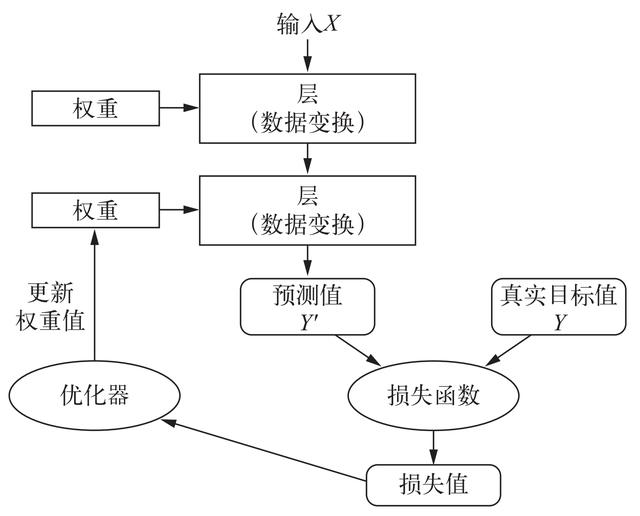
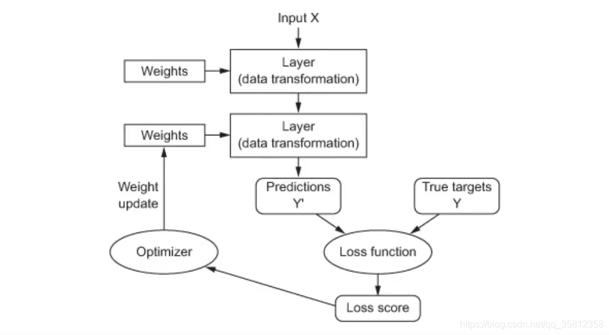
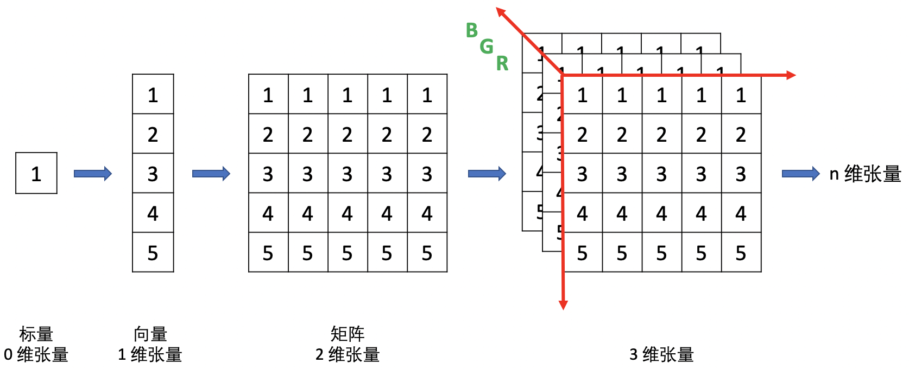

### 基本概念
	- 
	- 
	- 在机器学习中，分类问题中的某个类别叫做类（class），数据点叫做样本（sample），与某个样本对应的类叫做标签（label）。
	- 神经网路的核心组件叫作**层**（layer）（可以将层看作是数据过滤器，输入一些数据，出来的数据更有用）
	- 损失函数（loss function）：定义模型训练期间模型预测值与真实值之间的差异。
	- 优化器（optimizer）：使用诸如梯度下降算法来进行优化，用于调整神经网络中的权重和偏置，从而最小化损失函数，提高模型准确性。
- ### 神经网络的数据表示
	- 张量（tensor）：多维（0或n）数组，张量的维度通常叫作轴（axis），张量轴的个数叫作阶（rank），或者维（dimension）。
		- 
		- 标量（scalar）：0阶张量，仅包含1个数字
		- 向量（vector）：1阶张量，数字组成的数组
		- 矩阵（matrix）：2阶张量，向量组成的数组
		- 3阶或更高阶的张量：深度学习一般处理0~4阶张量，视频数据可能有5阶张量
	- 关键属性：3个关键属性
		- 轴的个数（阶数）
		- 形状：表示张量沿每个轴的维度大小（元素个数），如一个矩阵形状可以表示成 (3, 5)
		- 数据类型：dtype
	- 数据批量：
		- 一般来说，深度学习中的所有数据张量的第一个轴（0轴）都是样本轴（samples axis）
- ### 张量运算
	- #### 点积（举证乘法）
	- 矩阵变换